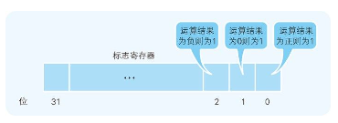

# 程序员眼中的CPU

## CPU的内部结构解析

从功能方面来看，如图 1-2 所示，CPU 的内部由寄存器、控制器、运算器和时钟四个部分构成，各部分之间由电流信号相互连通。

寄存器 可用来暂存指令、数据等处理对象，可以将其看作是内存的一种。根据种类的不同，一个 CPU 内部会有 20～100 个寄存器。控制器 负责把内存上的指令、数据等读入寄存器，并根据指令的执行结果来控制整个计算机。运算器 负责运算从内存读入寄存器的数据。时钟 负责发出 CPU 开始计时的时钟信号 2 。不过，也有些计算机的时钟位于 CPU 的外部。

## CPU 是寄存器的集合体

CPU 的四个构成部分中，程序员只需要了解寄存器即可，其余三个都不用太过关注。那么，为什么必须要了解寄存器呢？这是因为程序是把寄存器作为对象来描述的 。

## 程序计数器

## 条件分支和循环机制

条件分支和循环中使用的跳转指令 ，会参照当前执行的运算结果来判断是否跳转。表 1-1 所列出的寄存器中，我们提到了标志寄存器。无论当前累加寄存器的运算结果是负数、零还是正数，标志寄存器 都会将其保存（也负责存放溢出 10 和奇偶校验 11 的结果 )。

CPU 执行比较的机制很有意思，因此请大家务必牢记。例如，假设要比较累加寄存器中存储的 XXX 值和通用寄存器中存储的 YYY 值，执行比较的指令后，CPU 的运算装置就会在内部（暗中）进行 XXX－YYY 的减法运算。而无论减法运算的结果是正数、零还是负数，都会保存到标志寄存器中。结果为正表示 XXX 比 YYY 大，零表示 XXX 和 YYY 相等，负表示 XXX 比 YYY 小。程序中的比较指令，就是在 CPU 内部做减法运算。

## 函数调用机制

机器语言的 call 指令和 return 指令能够解决这个问题。建议大家把二者结合起来来记忆。函数调用使用的是 call 指令，而不是跳转指令。在将函数的入口地址设定到程序计数器之前，call 指令 会把调用函数后要执行的指令地址存储在名为栈的主存内。函数处理完毕后，再通过函数的出口来执行 return 命令。return 命令 的功能是把保存在栈中的地址设定到程序计数器中。

## 通过地址和索引实现数组

接下来我们看一下表 1-1 中出现的基址寄存器 和变址寄存器 。通过这两个寄存器，我们可以对主内存上特定的内存区域进行划分，从而实现类似于数组的操作。

首先，我们用十六进制数 16 将计算机内存上 00000000～FFFFFFFF 的地址划分出来。那么，凡是该范围的内存区域，只要有一个 32 位的寄存器，即可查看全部的内存地址。但如果想要像数组那样分割特定的内存区域以达到连续查看的目的，使用两个寄存器会更方便些。例如，查看 10000000 地址～1000FFFF 地址时，如图 1-9 所示，可以将 10000000 存入基址寄存器，并使变址寄存器的值在 00000000～0000FFFF 变化。CPU 则会把基址寄存器＋变址寄存器的值解释为实际查看的内存地址。变址寄存器的值就相当于高级编程语言程序中数组的索引功能。

