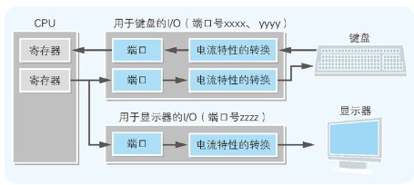

## 支撑硬件输入输出的 IN 指令和 OUT 指令
IN 指令 通过指定端口号的端口输入数据，并将其存储在 CPU 内部的寄存器中。OUT 指令 则是把 CPU 寄存器中存储的数据，输出到指定端口号的端口。

I/O 控制器中有用于临时保存输入输出数据的内存。这个内存就是端口 。I/O 控制器内部的内存，也称为寄存器。虽然都是寄存器，但它和 CPU 内部的寄存器在功能上是不同的。CPU 内部的寄存器是用来进行数据运算处理的，而 I/O 寄存器则主要是用来临时存储数据的。

## 外围设备的中断请求
IRQ 是用来暂停当前正在运行的程序，并跳转到其他程序运行的必要机制。该机制称为中断处理 。

实施中断请求的是连接外围设备的 I/O 控制器，负责实施中断处理程序的是 CPU。为了进行区分，外围设备的中断请求会使用不同于 I/O 端口的其他编号，该编号称为中断编号 。在控制面板中查看软盘驱动器的属性时，IRQ 处显示的数值 06，表示的就是用 06 号来识别软盘驱动器发出的中断请求。另一方面，操作系统及 BIOS 5 则会提供响应中断编号的中断处理程序。

假如同时有多个外围设备进行中断请求的话，CPU 也会为难。为此，我们可以在 I/O 控制器和 CPU 中间加入名为中断控制器 的 IC 来进行缓冲。中断控制器会把从多个外围设备发出的中断请求有序地传递给 CPU。

## 用中断来实现实时处理
由于外围设备有很多个，因此就有必要按照顺序来调查。按照顺序调查多个外围设备的状态称为轮询 。对几乎不产生中断的系统来说，轮询是比较合适的处理。不过，对计算机来说就不适合了。

## DMA 可以实现短时间内传送大量数据

DMA 是指在不通过 CPU 的情况下，外围设备直接和主内存进行数据传送。磁盘等都用到了这个 DMA 机制。通过利用 DMA，大量数据就可以在短时间内转送到主内存。

