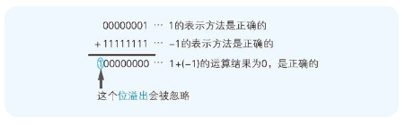
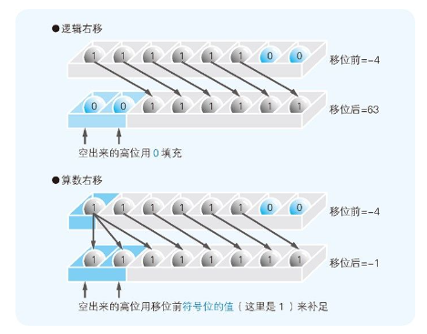

## 补数运算

为了获得补数，我们需要将二进制数的各数位的数值全部取反，然后再将结果加 1。例如，用 8 位二进制数表示－1 时，只需求得 1，也就是 00000001 的补数即可。

## 逻辑右移与算术右移

右移有移位后在最高位补 0 和补 1 两种情况。当二进制数的值表示图形模式而非数值时，移位后需要在最高位补 0。类似于霓虹灯往右滚动的效果。这就称为逻辑右移 （图 2-9）。

将二进制数作为带符号的数值进行运算时，移位后要在最高位填充移位前符号位的值（0 或 1）。这就称为算术右移。如果数值是用补数表示的负数值，那么右移后在空出来的最高位补 1，就可以正确地实现 1/2、1/4、1/8 等的数值运算。如果是正数，只需在最高位补 0 即可。

