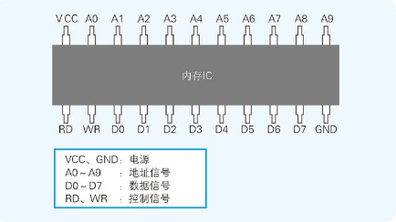
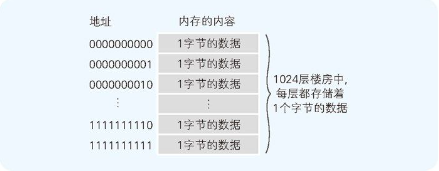

## 内存的物理机制
内存实际上是一种名为内存 IC 的电子元件。内存 IC 中有电源、地址信号、数据信号、控制信号等用于输入输出的大量引脚（IC 的引脚），通过为其指定地址（address），来进行数据的读写。

## 内存的逻辑模型
虽然内存的实体是内存 IC，不过从程序员的角度来看，也可以把它假想成每层都存储着数据的楼房，并不需要过多地关注内存 IC 的电源和控制信号等。

## 指针
指针 也是一种变量，它所表示的不是数据的值，而是存储着数据的内存的地址。通过使用指针，就可以对任意指定地址的数据进行读写。

## 数组是高效使用内存的基础
数组 是指多个同样数据类型的数据在内存中连续排列的形式。作为数组元素的各个数据会通过连续的编号被区分开来，这个编号称为索引 （index）。指定索引后，就可以对该索引所对应地址的内存进行读写操作。而索引和内存地址的变换工作则是由编译器自动实现的。

## 栈、队列以及环形缓冲区

## 链表