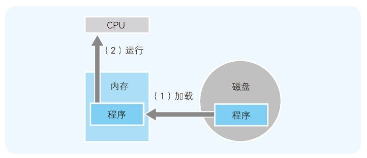

## 不读入内存就无法运行
程序保存在存储设备中，通过有序地被读出来实现运行，这一点大家都很清楚。这一机制称为存储程序方式 （程序内置方式），现在看来这是理所当然的，但在当时它的提出可以说是一个里程碑。为什么这么说呢？因为在此以前的程序都是通过改变计算机的布线等来变更程序的。

## 磁盘缓存加快了磁盘访问速度
磁盘缓存 指的是把从磁盘中读出的数据存储到内存空间中的方式。这样一来，当接下来需要读取同一数据时，就不用通过实际的磁盘，而是从磁盘缓存中把内容读出。使用磁盘缓存可以大大改善磁盘数据的访问速度

## 虚拟内存把磁盘作为部分内存来使用
通过借助虚拟内存，在内存不足时也可以运行程序。例如，在只剩下 5MB 内存空间的情况下也能运行 10MB 大小的程序。不过，就如本章开头所讲述的那样，CPU 只能执行加载到内存中的程序。虚拟内存虽说是把磁盘作为内存的一部分来使用，但实际上正在运行的程序部分，在这个时间点上是必须存在在内存中的。也就是说，为了实现虚拟内存，就必须把实际内存 （也可称为物理内存 ）的内容，和磁盘上的虚拟内存的内容进行部分置换（swap），并同时运行程序。

## 节约内存的编程方法
### 通过 DLL 文件实现函数共有
DLL （Dynamic Link Library）文件 6 ，顾名思义，是在程序运行时可以动态加载 Library（函数和数据的集合）的文件。此外，还有一个需要大家注意的地方，那就是多个应用可以共有同一个 DLL 文件。而通过共有同一个 DLL 文件则可以达到节约内存的效果。

### 通过调用 _stdcall 来减小程序文件的大小
C 语言中，在调用函数后，需要执行栈清理处理指令。栈清理处理 是指，把不需要的数据从接收和传递函数的参数时使用的内存上的栈区域中清理出去。该命令不是程序记述的，而是在程序编译时由编译器自动附加到程序中的。

## 磁盘的物理结构
