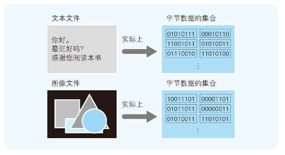
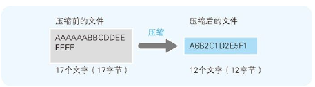

## 文件以字节为单位保存

## RLE算法的机制
像这样，把文件内容用“数据 × 重复次数”的形式来表示的压缩方法称为 RLE（Run Length Encoding，行程长度编码）算法（图 6-2）。RLE 算法是一种很好的压缩方法，经常被用于压缩传真的图像等 4 。因为图像文件本质上也是字节数据的集合体，所以可以用 RLE 算法来压缩。

通过表 6-1 可以看出，使用 RLE 算法对文本文件进行压缩后，文件却增大了，而且几乎是压缩前的 2 倍。这是因为文本文件中同样字符连续出现的部分并不多。

## 哈夫曼算法

## 可逆压缩和非可逆压缩
这里，我们把能还原到压缩前状态的压缩称为可逆压缩 ，无法还原到压缩前状态的压缩称为非可逆压缩 ，