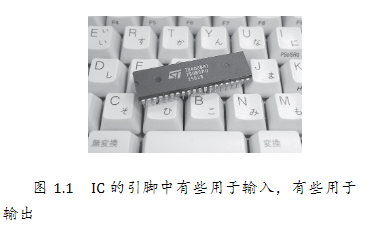

# 计算机的三大原则

## 计算机的三个根本性基础

1. 计算机是执行输入、运算、输出的机器

2. 程序是指令和数据的集合

3. 计算机的处理方式有时与人们的思维习惯不同

## 输入、运算、输出是硬件的基础

计算机的硬件由大量的 IC（Integrated Circuit，集成电路）组成（如图 1.1 所示）。

## 软件是指令和数据的集合

程序中的数据分为两类，一类是作为指令执行对象的输入数据，一类是从指令的执行结果得到的输出数据。

## 对计算机来说什么都是数字

## 为了贴近人类，计算机在不断地进化