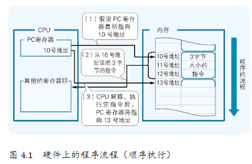
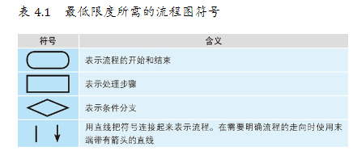

# 程序的流程

## 三种程序的流程

也就是说，程序基本上是从内存中的低地址（编号较小的地址）开始，向着高地址（编号较大的地址）流下去的 。我们把程序的这种流动称为“顺序执行”（如图 4.1 所示）。

程序的流程总共有三种。除了顺序执行以外，还有“条件分支”和“循环”。

## 流程图

## 结构化程序设计

简单地说，所谓结构化程序设计就是“为了把程序编写得具备结构性，仅使用顺序执行、条件分支和循环表示程序的流程即可，而不再使用跳转指令”。

因为跳转指令所带来的危害性不小，会使程序陷入到流程错综复杂的状态，就像意大利面条那样缠绕在一起（如图 4.11 所示）。

## 特殊的程序流程：中断处理与事件驱动

### 中断处理

中断处理是指计算机使程序的流程突然跳转到程序中的特定地方，这样的地方被称为中断处理例程（Routine）或是中断处理程序（Handler），而这种跳转是通过 CPU 所具备的硬件功能实现的。

### 事件驱动

事件驱动是一种适用于 GUI 环境的编程风格，在这种环境中用户可以通过鼠标和键盘来操作应用程序。